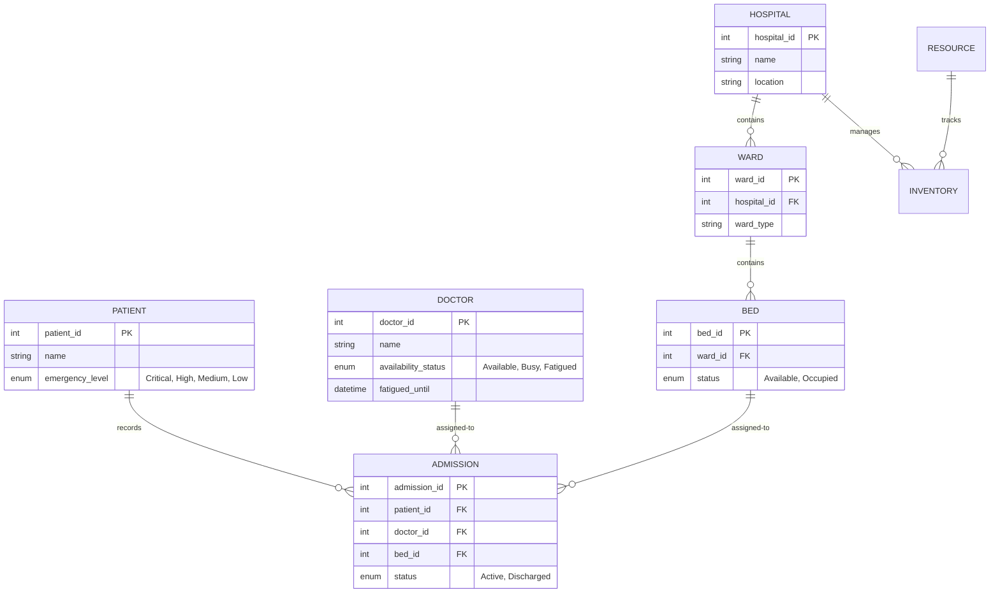

# EHRBMS System Architecture & Workflow

This document provides a deep dive into the technical implementation of the Emergency Hospital Resource & Bed Management System (EHRBMS), covering database design, backend connectivity, and automated workflows.

## 1. Python-MySQL Connectivity
The system uses the `mysql-connector-python` driver to interact with the database. Connectivity is managed via a centralized configuration and helper functions.

### Connection Management
- **`DB_CONFIG`**: A dictionary containing host, user, password, and database details.
- **`get_db()`**: A helper function that returns a new connection object for each request to ensure thread safety.
- **Auto-Commit**: The system is configured with `autocommit=True` for simplicity in small transactions.

### SQL Execution Helpers
The backend abstracts SQL execution into two primary functions:
1.  **`query_db(sql, params, fetch=True)`**: Used for `SELECT` operations. It uses a `dictionary` cursor to return results as a list of Python dictionaries (e.g., `[{"name": "Dr. Sharma", "specialization": "Cardiology"}, ...]`).
2.  **`execute_db(sql, params)`**: Used for DML (Data Manipulation Language) such as `INSERT`, `UPDATE`, and `DELETE`. It commits the transaction and returns the `lastrowid` for newly created records.

---

## 2. Database Schema & Relationships
The database consists of 8 core tables designed with strong referential integrity.

### Table Structure Overview

### Key Relationships
- **Hierarchical**: Beds are children of Wards, which are children of Hospitals. Deleting a Hospital or Ward would cascade (or block) based on foreign key constraints.
- **Transactional**: An Admission links a Patient, a Doctor, and a Bed together. This is the "active state" of the hospital.

---

## 3. Automated Triggers & Events
Automation is handled directly within the MySQL engine to ensure data consistency even if the API is bypassed.

### Triggers (The "Side Effects")
| Trigger Name | Timing | Table | Action |
| :--- | :--- | :--- | :--- |
| `trg_after_admission_insert` | `AFTER INSERT` | `admission` | Sets `bed.status = 'Occupied'` and `doctor.availability_status = 'Busy'`. |
| `trg_after_discharge_update` | `AFTER UPDATE`| `admission` | When status becomes 'Discharged', sets `bed.status = 'Available'`. If the doctor has no other active patients, sets their status to 'Available'. |
| `trg_inventory_check` | `AFTER UPDATE`| `inventory` | If `quantity` falls below `threshold_level`, it inserts a record into the `notification` table. |

### Scheduled Events (The "Cleaners")
- **`clear_doctor_fatigue`**: Runs every **1 minute**. It checks if a doctor's `fatigued_until` timestamp has passed and automatically resets their status to 'Available'.

---

## 4. Full System Workflow
The life cycle of a patient admission follow this path:

1.  **Registration**: A new `patient` record is created.
2.  **Admission Request**:
    -   API checks if the selected `Doctor` is currently `Fatigued` or `Busy`.
    -   API validates if the `Bed` is `Available`.
    -   **Mapping Check**: The system verifies that the Doctor's specialization and the Bed's type are appropriate for the Patient's `emergency_level`.
3.  **SQL Insert**: An `INSERT` query is sent to the `admission` table.
4.  **Automatic Side Effects**: The `trg_after_admission_insert` trigger fires instantly, marking the doctor as Busy and the bed as Occupied.
5.  **Steady State**: The patient is treated. Dashboard statistics (calculated via `COUNT` and `SUM` subqueries) reflect the current load.
6.  **Discharge**:
    -   The Admin updates the `admission` record status to `Discharged`.
    -   **Automatic Side Effects**: The `trg_after_discharge_update` trigger fires, freeing up the bed and doctor for the next patient.

---

## 5. Medical Assignment Constraints
The system enforces strict medical logic to ensure patients are assigned to the correct specialists and bed types based on their **Emergency Level**.

### Assignment Matrix

| Patient Level | Allowed Doctors (Specialization) | Allowed Bed Types |
| :--- | :--- | :--- |
| ** Critical** | `ICU`, `Emergency`, `Surgery`, `Cardiology`, `Neurology` | `ICU` only |
| ** High** | `Emergency`, `Surgery`, `Orthopedics`, `Cardiology`, `Neurology` | `Emergency`, `ICU` |
| ** Medium** | `General`, `Orthopedics`, `Pediatrics`, `ENT` | `General`, `Emergency` |
| ** Low** | `General`, `Dermatology`, `ENT`, `Pediatrics` | `General` |

### Key Logistics
- **Bed to Ward Mapping**: Every `Bed` is linked to a `Ward` via `ward_id`. Wards have a `ward_type` (e.g., "ICU", "General") that usually matches the `bed_type`.
- **Doctor to Patient Mapping**: The `admission` table is the primary link. A patient can only be admitted if a doctor with the appropriate specialization is marked as `Available`.
- **Trigger-Based Updates**: Once the mapping is validated by the API and the data is inserted, the `doctor` and `bed` are automatically marked as `Busy` and `Occupied` by the MySQL triggers, ensuring no double-bookings.
